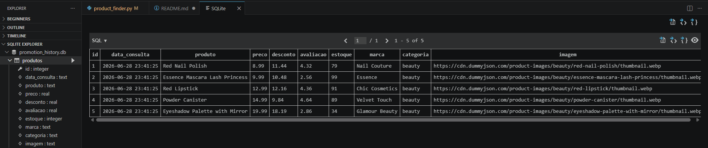
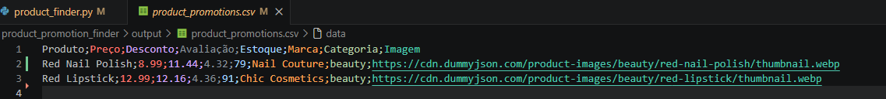

# 🛒 Product Promotion Finder

## 📚 This project is part of my hands-on Python learning journey, evolving step by step into a real-world promotion monitoring application.

A small Python project created as part of my journey from QA into programming, data processing and automation.

The application consumes data from a public REST API, allows the user to choose filters through the terminal, applies business rules, sorts the results, generates promotion-style summaries and exports the final dataset to CSV.

---

## ✨ Latest Update

This project has evolved from a simple product search script into a more complete promotion monitoring application.

## 🚀 What's New

* 📲 Automatic Telegram notifications for promotion alerts
* 💾 SQLite database for historical price storage
* 📊 Historical price comparison to identify real deals
* 🏗️ Refactored the project using Object-Oriented Programming (OOP)
* 🧩 Created the PromotionFinder class to organize the business logic
* 🧹 Improved code organization and maintainability

---

## ✨ Features

* 🌐 Fetch products from a REST API
* 📂 Display a category menu for the user
* ✅ Validate category selection with a loop
* 🔍 Filter by category
* 💰 Filter by maximum price
* ⭐ Filter by minimum rating
* 🔥 Filter by minimum discount percentage
* 📊 Sort products by price
* 🛒 Generate promotion cards in the terminal
* 📄 Export filtered results to CSV
* 💾 Store historical prices using SQLite
* 🚨 Detect new historical low prices
* 📲 Send promotion alerts to Telegram
* 🏗️ Organize the application using Object-Oriented Programming

---

## 🚀 Installation

Clone the repository:

```bash
git clone https://github.com/YOUR_USERNAME/product-promotion-finder.git
```

Navigate to the project folder:

```bash
cd product-promotion-finder
```

Install the dependencies:

```bash
pip install -r requirements.txt
```

---

## ▶️ Usage

Run the application:

```bash
python product_finder.py
```

Follow the prompts to:

* 📂 Select a product category
* 💰 Define the maximum price
* ⭐ Define the minimum rating
* 🔥 Define the minimum discount percentage
* 📊 Choose whether to compare current prices with the historical database

The application will:

* 🌐 Fetch products from the REST API
* 🔍 Apply the selected filters
* 📊 Sort products by price
* 🛒 Display promotion cards in the terminal
* 💾 Store the current results in a SQLite database
* 🚨 Detect new historical low-price promotions
* 📲 Send promotion alerts to Telegram
* 📄 Export the current results to output/product_list_current.csv
---

## 🔄 Current Flow

Choose category

⬇️

Define filters

⬇️

Fetch products from REST API

⬇️

Apply business rules

⬇️

Compare with historical database

⬇️

Detect promotion alerts

⬇️

Send Telegram notification

⬇️

Store history in SQLite

⬇️

Export CSV

---

## 🛠️ Technologies and Concepts

* 🐍 Python
* 🌐 Requests
* 📦 JSON Processing
* 📄 CSV Export
* 🧩 Functions
* ⚙️ Parameters
* 🔀 Conditional Logic
* 🔁 Loops
* 📊 Sorting
* ⌨️ User Input
* ✅ Basic Input Validation
* 💾 SQLite
* 📲 Telegram Bot API
* 🏗️ Object-Oriented Programming (OOP)
* 🔗 REST API Integration

---

## 💡 Why I Built This

I wanted to move beyond isolated programming exercises and build a project that resembles a real-world application.

As a QA professional, I naturally think in terms of business rules, data flow, validation and user experience. This project allowed me to practice Python while applying the same mindset used in software testing.

**Input → Processing → Validation → Output**

The goal was not only to learn Python syntax, but also to understand how data flows through an application, how business rules are translated into code, and how a project can evolve incrementally by adding new features over time.

---

## 📸 Screenshots

### 🛒 Terminal Output

The application displays the filtered products, promotion cards and historical price comparison directly in the terminal.

```text
🛒 Product: Red Nail Polish
💰 Price: $8.99
⭐ Rating: 4.36
🏷️ Category: beauty
🔥 Discount: 12.16%
----------------------------------------
```
```markdown

```
### 📲 Telegram Promotion Alert

When a new historical low price is detected, the application automatically sends a notification through a Telegram bot.


### 💾 SQLite Database

The application stores every execution in a SQLite database, allowing future historical price comparisons.



### 📄 CSV Output

The filtered products are also exported to a CSV file for further analysis.



---

## 📈 Project Evolution

This project started as a simple Python exercise to consume a REST API and filter products.

As the development progressed, new features were added step by step, transforming it into a small real-world application.

* ✅ Current Features
* 🌐 REST API integration
* 🔎 Product filtering and sorting
* 📁 CSV export
* 💾 SQLite database for historical price storage
* 📊 Historical price comparison
* 🚨 Promotion alert detection
* 📲 Telegram Bot integration
* 🏗️ Object-Oriented Programming (OOP)
* 🚀 Next Stage

The next goal is to evolve the project into a production-oriented application by integrating real e-commerce marketplaces, improving the architecture, and exploring AI-powered automation.

---

## 🔮 Future Improvements

* 🛍️ Integrate with real e-commerce marketplaces (Mercado Livre, Shopee, Netshoes, Amazon, etc.)
* ⏰ Schedule automatic price monitoring
* 📧 Support additional notification channels such as Email and WhatsApp
* 📊 Create dashboards and promotion analytics
* ✨ Generate AI-powered promotional descriptions
* 🤖 Build AI agents to analyze, rank and summarize the best offers
* 💰 Integrate with affiliate programs to monetize the platform
* ☁️ Deploy the application to the cloud for continuous monitoring